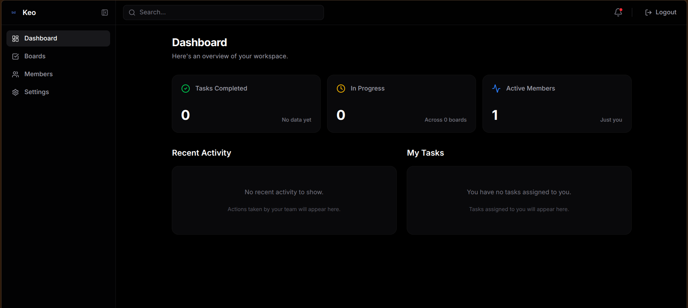

<div align="center">
  <br />
  
  <h1>Keo</h1>
  <p>
    <strong>A modern, collaborative project management platform.</strong>
    <br />
    The ultimate open-source, self-hostable alternative to Trello, Jira, and Linear.
  </p>
  <br />
</div>

## 🚀 Overview

**Keo** is a lightweight, privacy-first project management platform built for modern teams. It combines the simplicity of a Kanban board with the speed and aesthetics of modern web applications. Organize your work, collaborate instantly, and ship faster—all while keeping complete ownership of your team's data on your own infrastructure.

<div align="center">
  
</div>

## ✨ Features

- **Blazing Fast Kanban Board**: Buttery smooth drag-and-drop powered by `@dnd-kit/core`. Create, edit, and move tasks seamlessly.
- **Dynamic Columns**: Customize your workflow by adding and removing columns instantly.
- **Real-Time UI Updates**: Optimistic UI state updates ensure the interface responds in 0ms while silently syncing with the database.
- **JWT Authentication**: Secure login and signup flows with password hashing via `bcrypt`.
- **Members Directory**: View and manage all organization members in a beautiful grid layout.
- **Group Management**: Create and manage isolated workspaces with role-based permissions. Admins can configure settings, manage members, and organize boards seamlessly.
- **User Settings**: Update your profile information and manage your password securely.
- **Dark Mode Native**: A stunning, premium dark mode aesthetic built with Tailwind CSS.
- **Zero Lock-in**: 100% open-source. Host it yourself and control your data.

## 🛠 Tech Stack

Keo is built as a modern full-stack monorepo:

### Frontend
- **Framework**: [Next.js 15 (App Router)](https://nextjs.org/)
- **Language**: TypeScript
- **Styling**: [Tailwind CSS](https://tailwindcss.com/)
- **Components**: [Shadcn UI](https://ui.shadcn.com/) & [Lucide Icons](https://lucide.dev/)
- **Drag & Drop**: [@dnd-kit](https://dndkit.com/)
- **Animations**: [Motion/React](https://motion.dev/)

### Backend
- **Framework**: [Hono](https://hono.dev/) (Ultra-fast web framework)
- **Language**: TypeScript
- **ORM**: [Drizzle ORM](https://orm.drizzle.team/)
- **Database**: PostgreSQL
- **Security**: JWT, bcryptjs

## 📦 Local Development

Keo is split into a `frontend` and a `backend`. Follow the steps below to run both locally.

### Prerequisites
- Node.js (v18+)
- [Bun](https://bun.sh/) (Recommended for speed)
- PostgreSQL Database (Local or Cloud)

### 1. Clone the repository
```bash
git clone https://github.com/IsmeetXD/keo.git
cd keo

# Set up the root environment variables
cp .env.example .env
```

### 2. Setup the Backend
```bash
cd backend
npm install

# Set up your backend environment variables
cp .env.example .env
# Edit .env and add your PostgreSQL DATABASE_URL and JWT_SECRET

# Push the schema to your database
npx drizzle-kit push

# Start the backend server (runs on http://localhost:3001)
npm run dev
```

### 3. Setup the Frontend
Open a new terminal window:
```bash
cd frontend
npm install

# Set up your frontend environment variables
cp .env.example .env.local

# Start the frontend dev server (runs on http://localhost:3000)
npm run dev
```

## 🛠 Available Commands

### Backend Commands (run in `/backend`)
| Command | Description |
|---|---|
| `npm run dev` | Start the backend development server using `tsx` |
| `npm run build` | Build the backend with TypeScript |
| `npm run start` | Start the production backend server |
| `npx drizzle-kit push` | Push schema changes directly to the database |
| `npx drizzle-kit generate` | Generate SQL migration files |
| `npx drizzle-kit studio` | Open Drizzle Studio to view your database visually |

### Frontend Commands (run in `/frontend`)
| Command | Description |
|---|---|
| `npm run dev` | Start the Next.js development server |
| `npm run build` | Build the Next.js app for production |
| `npm run start` | Start the production Next.js server |
| `npm run lint` | Run ESLint |

## 🌐 Deployment (Self-Hosting)

Keo is designed to be easily self-hostable. 
1. Provision a PostgreSQL database (e.g., Supabase, Neon, or a local Docker instance).
2. Deploy the `backend` using Node.js or Docker. Ensure you set the `DATABASE_URL` and `JWT_SECRET`.
3. Deploy the `frontend` using Vercel, Netlify, or a standard Node.js server. Update the backend API URL in the frontend fetch calls if you deploy the backend to a remote domain.

## 🤝 Contributing

Contributions, issues, and feature requests are welcome! 
Feel free to check the [issues page](https://github.com/IsmeetXD/keo/issues).

## 📄 License

This project is open-source and available under the [MIT License](LICENSE).
